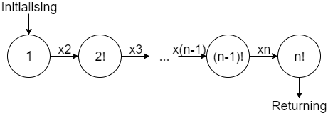
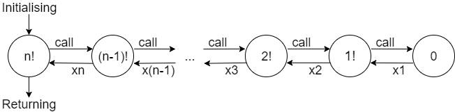

Have you ever heard of Amish friendship bread? It's a special recipe made from a sourdough starter. Part of this starter is used to bake cakes or to share with friends. But a cup of the starter has to be kept to start a new cycle: by adding one cup each of sugar, flour, and milk every five days, you get a new starter portion! Basically, this bread is using its own yeast to develop.

[source](http://www.saveur.com/amish-friendship-bread-baking-tradition)  

There is a similar concept in programming. Some functions can use their own values to calculate a new outcome. These are called *recursive functions*. Recursive functions work in two steps:
* Just like Amish bread needs a sourdough starter, recursive functions need a *base case*;
* We need to add sugar, flour, and milk to Amish bread so that it can develop and so recursive functions need a *recursion step* to pass from one value to another.

**Recursive definition**

Let use the factorial function to explain the notions of *base case* and *recursion step* through an example.
If you have never heard of factorial function before, please **do** check the Wikipedia article about factorial [here](https://en.wikipedia.org/wiki/Factorial) before continuing reading.

Let $n$ a nonnegative integer, $n! = 1 \times 2 \times ... \times (n-1) \times n$. This is the usual definition of $n!$.

We could also define the factorial like this:
* By convention, $0! = 1$. That is a convention but if you are willing to know why $0!$ equals 1, please do check out [this link](https://www.thoughtco.com/why-does-zero-factorial-equal-one-3126598).
* Now imagine you already know the value of $n!$ and you'd like to calculate the value of $(n+1)!$. Based on the definition above, we can see that $(n+1)!$ is actually equalled to $n! \times (n+1)$.

So another definition of the factorial function is:
* *Base case*: $0! = 1$;
* *Recursion step*: knowing $n!$, we can calculate $(n+1)! = n! \times (n+1)$.
This is the *recursive definition*, based on the knowledge of both the *base case* and the *recursion step*.

That's it for the mathematical definition of recursive functions. But how should we implement such functions?

**Recursive programming**

These are the scripts for the factorial function in *Python*.
Find more information about functions in Python [here](https://www.tutorialspoint.com/python/python_functions.htm).

We can implement the usual definition of the factorial function like this:
```
def factorial(n):
    factorial_n = 1         # initialising the value
    for i in range(2,n+1):  # remember that range does not include n+1
        factorial_n = factorial_n * i
    return factorial_n
```
This is the usual product: we are multiplying all the numbers from 1 to $n$. The following diagram represents the different values taken by the variable `factorial_n`.



We can implement the recursive definition of the factorial function like this:
```
def factorial_rec(n):
    if n == 0:
        return 1
    else:
        return n * factorial_rec(n-1)
```
The following diagram explains the dynamics of this function:


The function is calling the previous values until it reaches the *base case*, and then it goes back to the result by applying the *recursive step*.

**Why is recursion useful?**

The factorial function has both a recursive definition and a non-recursive definition. The Church-Turing thesis ([Wikipedia](https://en.wikipedia.org/wiki/Church%E2%80%93Turing_thesis)) proves that all recursive functions can be define in a non-recursive way. Then why is recursion useful?

Certain problems can be solved just as easily with a loop and to force yourself to use recursion will not make your programs better. However if you're doing a lot of programming, you will need to understand recursion and when - and when not - to use it.
* when dealing with nested structures like a tree in graph theory, where the same type of entry can appear in multiple places, recursion makes it easier to step through the items in the tree - to walk the tree;
* when programming "divide and conquer" type algorithms, one needs to apply the same algorithm to two smaller parts of the problem. Recursion allows you to keep any solution to these smaller problems and then put them back together as the final result.
